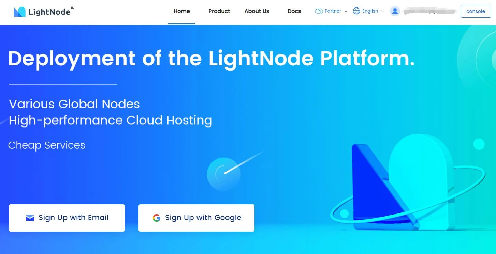

# 5 Ultra-Stable Hong Kong VPS Providers (Perfect for Website Hosting)

---

If you're running a website that doesn't require mainland China hosting, Hong Kong VPS servers offer an incredibly convenient solution. No tedious registration requirements, instant deployment, and you can have your site live in about 10 minutes. But here's the catch: not all Hong Kong VPS providers are created equal. The real question is—which ones actually deliver rock-solid network stability?

Through my own testing and real-world experience, I've found that network stability boils down to two key factors: choosing established providers and prioritizing premium network routes like CN2 GIA. Let me walk you through five providers that actually deliver on their promises.

---

## What I Actually Look For

My criteria are pretty straightforward: **no ID verification hassles, Alipay support, and proven stability through at least a year of personal use**. I'm not talking about budget providers like DogYun or similar bargain-basement options—those might save you a few bucks, but they're reliability nightmares for serious websites.

Think of it this way: you wouldn't trust your business to a server that randomly goes offline, right? That's exactly why I stick with proven players.

## BandwagonHost (My Top Pick for Speed)

Here's something I've learned after running two servers for over a year: sometimes the best "Hong Kong" solution isn't actually in Hong Kong. BandwagonHost's US servers with CN2 GIA routes consistently outperform many actual Hong Kong VPS options.

Yes, their Hong Kong servers are pricey. But their **US Los Angeles CN2 GIA plan at $49** is where the magic happens. I'm currently running two production websites on these servers, and here's what impressed me:

**Network Routes:**
- China Telecom & China Unicom: Full CN2 GIA routing both ways
- China Mobile: Direct connection outbound, CN2 GIA return
- Bandwidth: 1Gbps (this is massive for a VPS)

**Test IP:** `173.242.115.254`

The speed difference is night and day compared to standard routes. Pages load instantly, even during peak hours. If you absolutely need Hong Kong specifically, they do offer CN2 GIA Hong Kong servers (Test IP: `93.179.124.1`), though you'll pay premium prices.

**Payment Options:** Alipay, Credit Card, PayPal

Looking for a VPS provider that actually delivers on speed promises? BandwagonHost's CN2 GIA infrastructure is specifically engineered for optimal China-to-US connectivity, making it feel faster than many Hong Kong alternatives. 👉 [Check out BandwagonHost's performance-optimized plans that serious website owners trust](https://bandwagonhost.com/aff.php?aff=79616)

## LightNode (The Global Coverage Champion)

LightNode caught my attention because they've been quietly operating since 2002—that's over two decades of experience. Their pricing model is refreshingly flexible: **starting at $7.71/month with hourly billing**. You only pay for what you use, and traffic is calculated one-way.

Here's what makes them stand out: you can deploy unlimited instances after your initial $10 deposit. They also throw in a random $5-20 bonus on your first top-up, which is a nice touch.

**Data Centers (No kidding, they're everywhere):**
- **Asia:** Hong Kong, Taipei, Seoul, Bangkok, Hanoi, Ho Chi Minh, Singapore, Phnom Penh, Manila, Dhaka, Kuala Lumpur, Tokyo
- **Middle East:** Dubai, Riyadh, Jeddah, Istanbul  
- **Europe:** Frankfurt
- **Americas:** Silicon Valley, Washington, São Paulo
- **Africa:** Johannesburg

**Why I recommend them:** No ID verification required, established provider with a solid track record, and Alipay support for easy payments.

**Payment Methods:** Alipay, UnionPay, PayPal, Google Pay, Visa, Mastercard, AmEx

**Official Site:** [https://www.lightnode.com/](https://www.lightnode.com/?inviteCode=MOGNKA&promoteWay=LINK)

## SugarHosts (The Unlimited Storage Beast)

SugarHosts launched their Hong Kong servers back in 2014, and they've maintained a solid reputation since. What makes them interesting is their target audience—they're particularly popular among video site operators.

**Here's the deal-breaker feature:** For around 350 RMB, you can host up to 20 websites with unlimited image storage. If you're running content-heavy sites with lots of media, this is huge.

**Critical tip:** When selecting Hong Kong region, make sure you choose the **"Asia Optimized" route**. They have two Hong Kong zones, and this distinction matters for performance.

**Background:** SugarHosts started in 2015 and operates data centers across the US, Philippines, and UK. They focus on fast, reliable, and secure infrastructure. What I appreciate is their flexibility—you can upgrade or downgrade plans anytime, and they offer unlimited bandwidth.

Their US-based support team operates 24/7 with lifetime free technical support. That's peace of mind you can't put a price on.

**Data Centers:** US, Hong Kong  
**Payment Methods:** Alipay, Credit Card, PayPal

---

## What Actually Matters When Choosing a Hosting Provider

Let me break down the essentials based on what I've learned the hard way:

**Stability is non-negotiable.** Your server needs to stay online consistently. Frequent downtime or network instability will kill your traffic and reputation. Before committing, check customer reviews and look for providers with established track records.

**Security can't be an afterthought.** Your server environment needs proper protection against data breaches and attacks. This includes regular security updates, firewall protection, and backup systems.

**Bandwidth determines your growth ceiling.** As your traffic increases, you need a host that can handle the load. Insufficient bandwidth means slow page loads and frustrated visitors. When comparing plans with BandwagonHost's industry-leading infrastructure, you'll notice how generous bandwidth allocation directly impacts user experience. 👉 [Explore BandwagonHost's high-bandwidth solutions built for growing websites](https://bandwagonhost.com/aff.php?aff=79616)

**Hardware configuration affects responsiveness.** The server's CPU, RAM, and storage type determine how quickly your site responds to requests. Match your hardware to your website's actual needs and expected traffic.

**Support matters when things go wrong.** And things will go wrong eventually. You need a provider with responsive technical support that can solve problems quickly. Look for 24/7 availability and multiple support channels.

**Price should match value, not just be cheap.** The absolute cheapest option usually cuts corners somewhere—often in stability, support, or performance. Calculate your budget based on what you actually need, not just what costs less.

## Final Thoughts

After managing multiple websites across different VPS providers for several years, I've learned that network stability isn't just about the physical location—it's about the quality of network routes, provider infrastructure, and support reliability.

For most users targeting Chinese audiences, BandwagonHost's CN2 GIA routes consistently deliver the best performance-to-price ratio. Their US servers often outperform actual Hong Kong VPS options due to superior routing infrastructure. LightNode excels if you need global coverage or flexible billing, while SugarHosts is unbeatable for media-heavy sites needing unlimited storage.

The bottom line? Don't just chase the "Hong Kong" label or the lowest price. Focus on providers with proven stability, quality network routes, and infrastructure that can grow with your needs. Your website's success depends on it.
